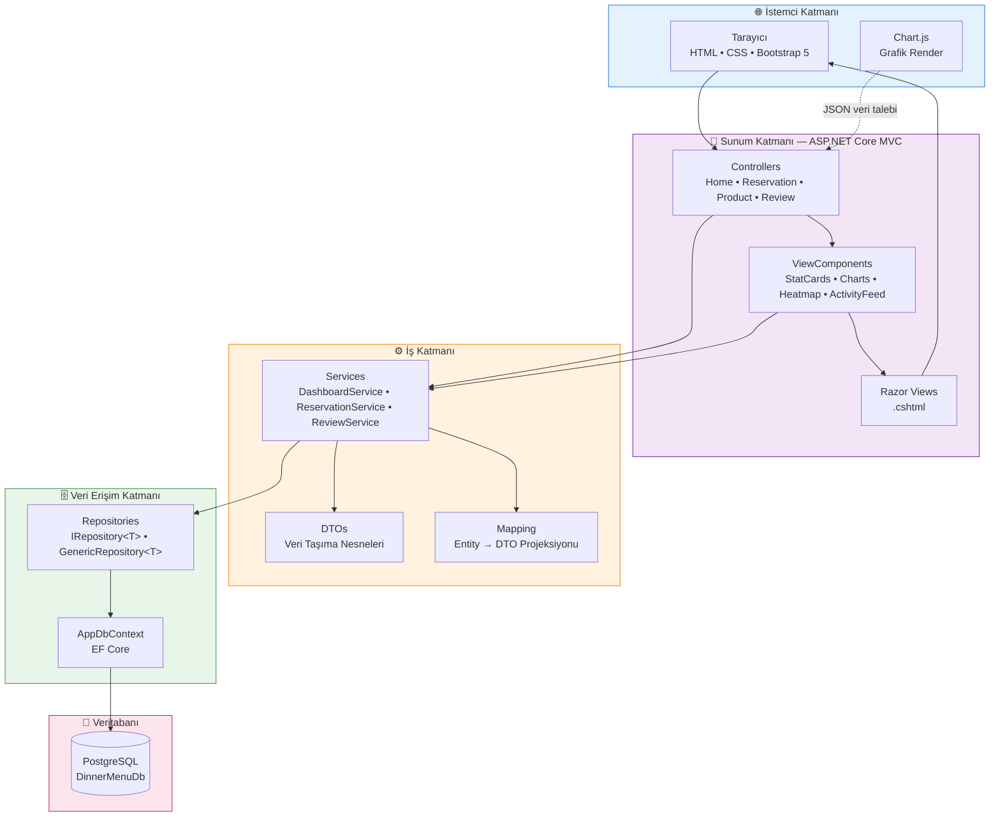
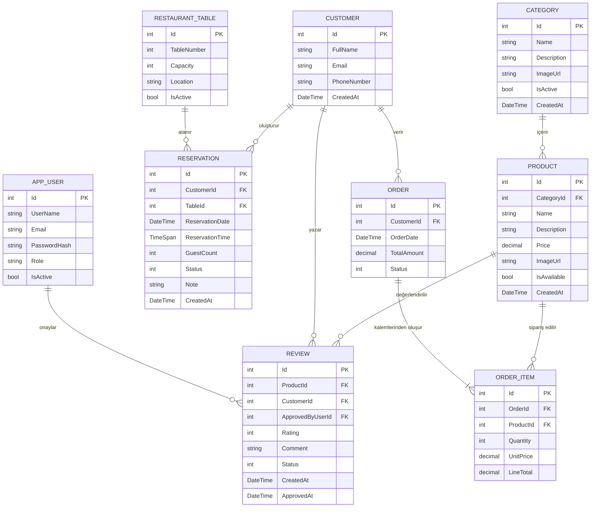
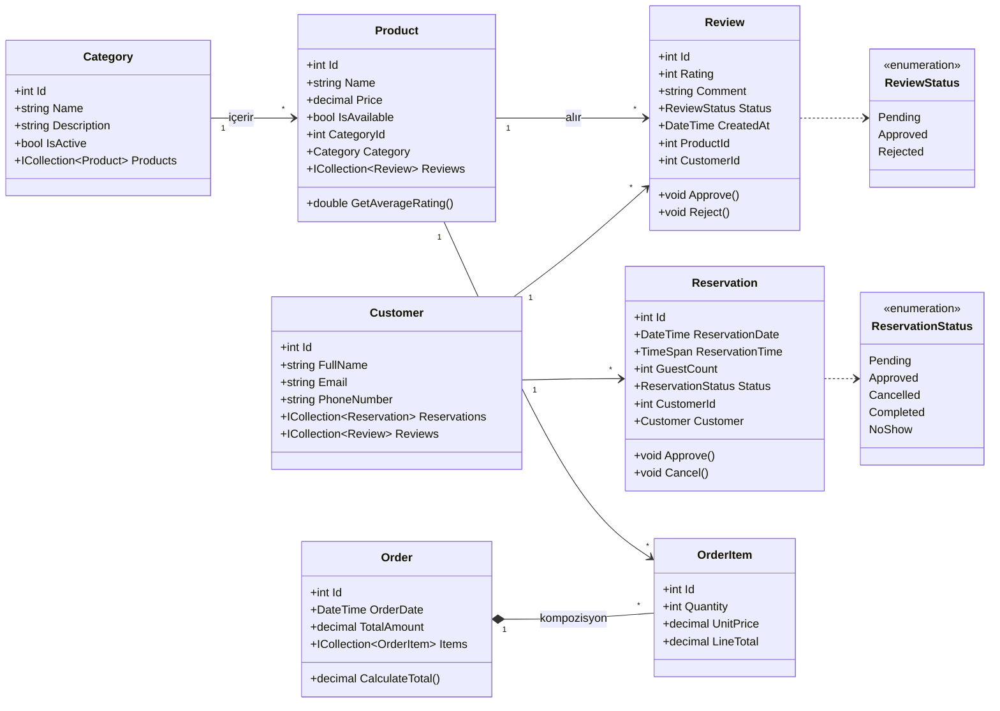
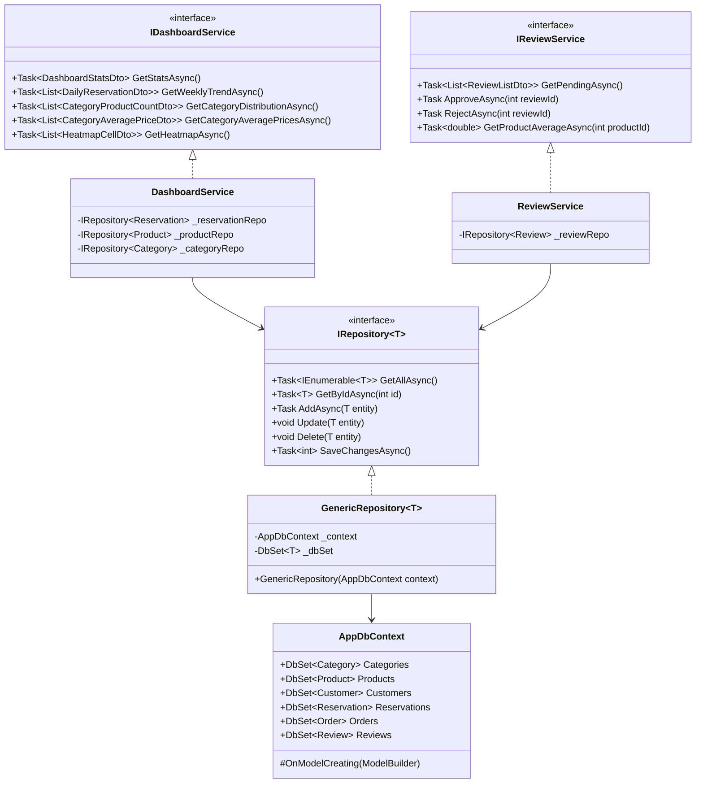
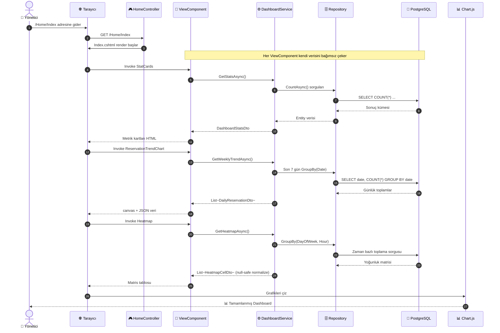
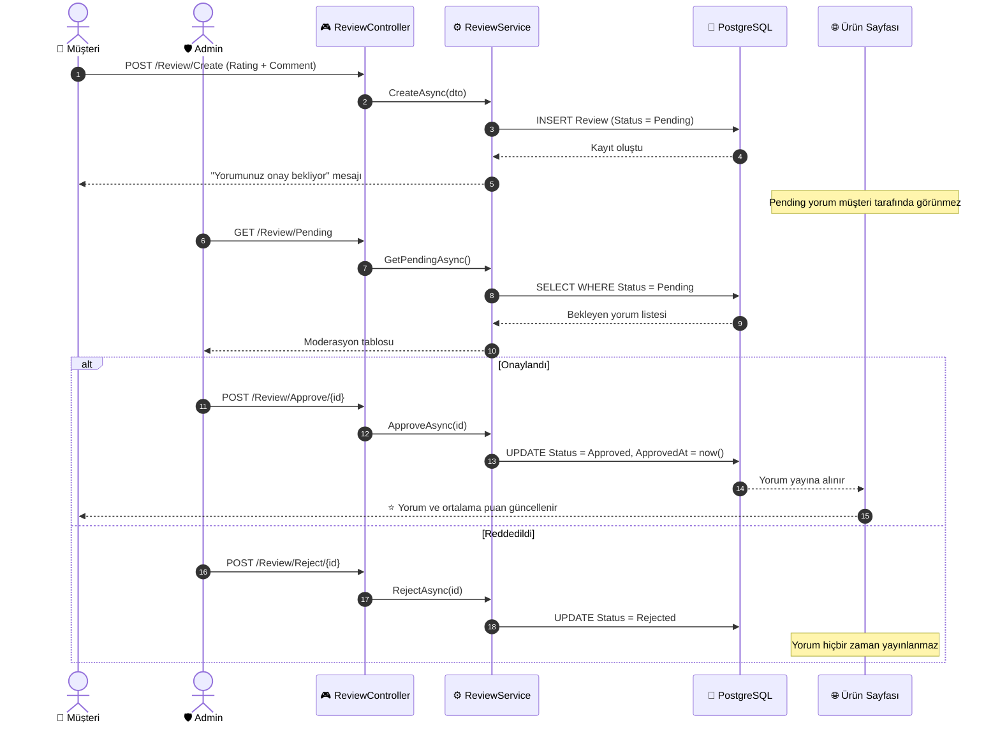
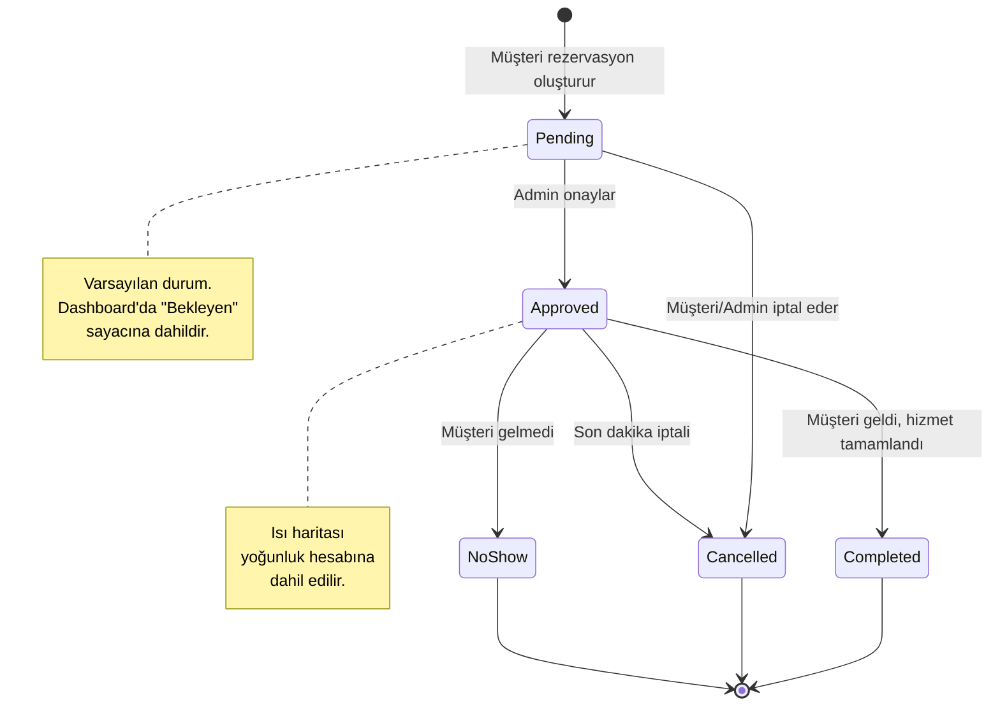
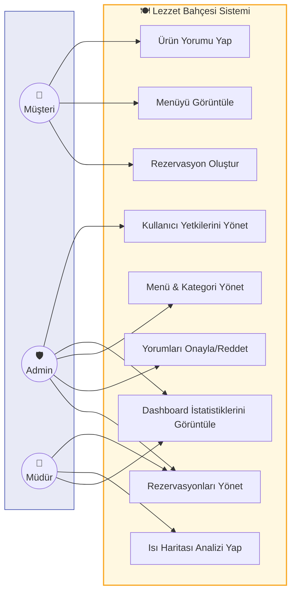

<div align="center">

# 🍽️ Lezzet Bahçesi

### Restoran Operasyon Yönetim Paneli & Analitik Dashboard

*Rezervasyonlar, siparişler, menü ve müşteri geri bildirimleri — tek ekranda, canlı verilerle.*

<br>

[](https://dotnet.microsoft.com/)
[](https://learn.microsoft.com/dotnet/csharp/)
[](https://www.postgresql.org/)
[](https://learn.microsoft.com/ef/core/)
[](https://getbootstrap.com/)
[](https://www.chartjs.org/)
[](LICENSE)

<br>

**🇹🇷 Türkçe** &nbsp;•&nbsp; [🇬🇧 English](README.en.md)

</div>

---

## 📑 İçindekiler

- [Proje Hakkında](#-proje-hakkında)
- [Öne Çıkan Özellikler](#-öne-çıkan-özellikler)
- [Ekran Görüntüleri](#-ekran-görüntüleri)
- [Teknoloji Yığını](#️-teknoloji-yığını)
- [Sistem Mimarisi](#️-sistem-mimarisi)
- [Klasör Yapısı](#-klasör-yapısı)
- [Veritabanı Tasarımı & ER Diyagramı](#️-veritabanı-tasarımı--er-diyagramı)
- [UML Diyagramları](#-uml-diyagramları)
- [İstek Yaşam Döngüsü](#-i̇stek-yaşam-döngüsü-request-lifecycle)
- [Kurulum ve Çalıştırma](#-kurulum-ve-çalıştırma)
- [Yapılandırma](#-yapılandırma)
- [Rota Haritası](#️-rota-haritası)
- [Sık Karşılaşılan Sorunlar](#-sık-karşılaşılan-sorunlar)
- [Yol Haritası](#-yol-haritası)
- [Katkıda Bulunma](#-katkıda-bulunma)
- [Lisans](#-lisans)
- [Geliştirici](#️-geliştirici)

---

## 🎯 Proje Hakkında

Bir restoranın günlük işleyişinde veriler dağınıktır: rezervasyon defteri ayrı, sipariş fişleri ayrı, müşteri yorumları ayrı bir yerdedir. **Lezzet Bahçesi**, bu parçalı akışı tek bir yönetim panelinde toplayarak işletme sahibinin *"Bugün kaç rezervasyon var? Hangi saatler yoğun? Hangi ürün beğenilmiyor?"* sorularına saniyeler içinde cevap vermesini sağlar.

Uygulama **ASP.NET Core MVC** üzerine kurulmuş, veri katmanında **PostgreSQL + Entity Framework Core (Code First)** kullanan, katmanlı mimari ilkelerine sadık bir web projesidir. Arayüz parçaları **ViewComponent**'ler ile modülerleştirilmiş, katmanlar arası veri taşıma **DTO** desenleriyle izole edilmiştir.

### Neden bu proje?

| Problem | Çözüm |
|---|---|
| Rezervasyon yoğunluğu tahmine dayalı yönetiliyor | Gün × saat kırılımlı **ısı haritası** ile gerçek yoğunluk görselleştirmesi |
| Yorumlar denetimsiz yayınlanıyor | **Admin onay mekanizması** ile `Status` bazlı moderasyon |
| Menü performansı ölçülemiyor | Kategori bazlı **ürün dağılımı** ve **ortalama fiyat** analizleri |
| Veriler farklı ekranlara dağılmış | Tek sayfada **canlı metrik kartları** ve aktivite akışı |

### Temel Tasarım Kararları

- **Controller'lar ince tutuldu** — iş mantığı servis katmanında, veri erişimi repository katmanında.
- **Entity'ler asla View'a gönderilmedi** — tüm sunum verisi DTO üzerinden aktarılır (over-posting ve lazy-loading tuzaklarına karşı).
- **Dashboard bileşenleri bağımsız** — her kart/grafik kendi ViewComponent'i olduğu için biri hata verse bile sayfanın geri kalanı ayakta kalır.
- **Null-safe sorgular** — analitik sorgularda `??`, `DefaultIfEmpty()` ve `GroupBy` sonrası güvenli projeksiyon kullanılarak boş veri setlerinde çökme engellendi.

---

## 🚀 Öne Çıkan Özellikler

<details open>
<summary><h3>📊 1. Dinamik Dashboard & İstatistik Paneli</h3></summary>

**Canlı Metrik Kartları**
- Toplam rezervasyon sayısı
- Bekleyen / Onaylanan / İptal edilen rezervasyon kırılımı
- Bugünkü sipariş adedi
- Toplam müşteri sayısı
- Aktif menü ürünü sayısı

**Görsel Analiz Grafikleri (Chart.js)**

| Grafik | Tür | Ne Anlatır? |
|---|---|---|
| 📈 Günlük Rezervasyon Trendi | Line | Son 7 günün rezervasyon hareketi, artış/düşüş eğilimi |
| 📊 Kategoriye Göre Ürün Dağılımı | Bar | Hangi kategoride kaç aktif ürün var, menü dengesi |
| 🍩 Kategori Ortalama Fiyatları | Doughnut | Kategorilerin fiyat konumlanması + özel kaydırmalı (custom scrollbar) renkli liste |

**Canlı Aktivite Akışı** — Son işlemler (yeni rezervasyon, yeni yorum, sipariş) zaman sıralı akış olarak listelenir.

</details>

<details open>
<summary><h3>💬 2. Müşteri Değerlendirmeleri (Review Management)</h3></summary>

- **Ürün bazlı yorum sistemi:** Her menü ürünü için ayrı puanlama (1–5 ⭐) ve serbest metin değerlendirmesi.
- **Admin onay mekanizması:** Yorumlar varsayılan olarak `Pending` durumunda kaydedilir; yalnızca `Approved` olanlar müşteri tarafında görünür.
- **Toplu moderasyon:** Panelden onayla / reddet / sil aksiyonları.
- **Ortalama puan hesabı:** Ürünün ortalama yıldızı yalnızca onaylı yorumlar üzerinden hesaplanır.

</details>

<details open>
<summary><h3>🔥 3. Isı Haritası & Yoğunluk Analizi (Heatmap)</h3></summary>

- **Matris tabanlı görselleştirme:** Haftanın günleri (satır) × saat dilimleri (sütun: 12:00, 14:00, 16:00, 18:00, 20:00, 22:00).
- **Renk yoğunluğu:** Hücre rengi o gün/saatteki rezervasyon sayısıyla orantılı olarak koyulaşır.
- **Operasyonel katkı:** Personel vardiya planlaması ve stok hazırlığı için yoğun saatlerin tespiti.
- **Null-safe veri işleme:** Rezervasyon olmayan gün/saat kombinasyonları `0` olarak normalize edilir; matriste boşluk oluşmaz.

</details>

<details>
<summary><h3>📅 4. Rezervasyon Yönetimi</h3></summary>

- Durum makinesi ile yönetilen rezervasyon akışı (`Pending → Approved → Completed` / `Cancelled` / `NoShow`).
- Tarih, saat, kişi sayısı, masa ve iletişim bilgisi alanları.
- Filtreleme: tarihe, duruma ve müşteriye göre.

</details>

<details>
<summary><h3>🍕 5. Menü & Kategori Yönetimi</h3></summary>

- Kategori CRUD işlemleri, aktif/pasif durum yönetimi.
- Ürün CRUD işlemleri: ad, açıklama, fiyat, görsel, kategori ilişkisi.
- Pasife alınan kategorinin ürünleri analitiklerden otomatik olarak düşer.

</details>

---

## 📸 Ekran Görüntüleri

> Görselleri `wwwroot/images/screenshots/` klasörüne ekleyip aşağıdaki yolları güncelleyin.

<div align="center">

| Dashboard Ana Ekran | Kategori & Grafik Analizleri |
|:---:|:---:|
|  |  |
| **Rezervasyon Isı Haritası** | **Yorum Moderasyon Paneli** |
|  |  |

</div>

---

## 🛠️ Teknoloji Yığını

| Katman | Teknoloji | Kullanım Amacı |
|---|---|---|
| **Dil & Runtime** | C# 12, .NET 8.0 | Uygulama çekirdeği |
| **Web Framework** | ASP.NET Core MVC | Controller / View / Routing altyapısı |
| **ORM** | Entity Framework Core 8 | Code First, LINQ sorguları, Migration yönetimi |
| **Veritabanı** | PostgreSQL 16 | İlişkisel veri deposu |
| **DB Sağlayıcı** | Npgsql.EntityFrameworkCore.PostgreSQL | EF Core ↔ PostgreSQL köprüsü |
| **Frontend** | HTML5, CSS3, JavaScript (ES6+) | Arayüz ve etkileşim |
| **UI Kütüphanesi** | Bootstrap 5.3 | Responsive grid, bileşenler |
| **Görselleştirme** | Chart.js 4 | Line / Bar / Doughnut grafikleri |
| **Şablon Motoru** | Razor (.cshtml) | Sunucu taraflı render |
| **Mimari Desenler** | Repository, DTO, ViewComponent, Dependency Injection | Modülerlik ve test edilebilirlik |
| **Araçlar** | Visual Studio 2022 / VS Code, pgAdmin 4, Git | Geliştirme ortamı |

---

## 🏗️ Sistem Mimarisi

Proje, sorumlulukların net biçimde ayrıldığı **katmanlı (layered) mimari** ile kurgulanmıştır. Üst katman yalnızca bir alt katmanı tanır; ters yönde bağımlılık yoktur.



### Uygulanan Tasarım Desenleri

| Desen | Nerede? | Kazanım |
|---|---|---|
| **Repository Pattern** | `Repositories/` | Veri erişim mantığı soyutlandı; `DbContext` iş katmanına sızmıyor |
| **DTO Pattern** | `DTOs/` | Entity'ler View'a gönderilmiyor; yalnızca gerekli alanlar taşınıyor |
| **ViewComponent** | `ViewComponents/` | Dashboard'daki her bileşen bağımsız, yeniden kullanılabilir ve kendi verisini çeken bir birim |
| **Dependency Injection** | `Program.cs` | Servis ve repository'ler constructor üzerinden enjekte ediliyor; gevşek bağlılık |
| **Code First + Migrations** | `Migrations/` | Şema versiyonlanıyor, ekipler arası tutarlılık sağlanıyor |

---

## 📁 Klasör Yapısı

```
LezzetBahcesi/
│
├── 📂 Controllers/
│   ├── HomeController.cs              # Dashboard giriş noktası
│   ├── ReservationController.cs       # Rezervasyon CRUD & filtreleme
│   ├── ProductController.cs           # Menü ürünleri yönetimi
│   ├── CategoryController.cs          # Kategori yönetimi
│   └── ReviewController.cs            # Yorum moderasyonu
│
├── 📂 Models/                          # EF Core Entity'leri (Domain)
│   ├── Category.cs
│   ├── Product.cs
│   ├── Customer.cs
│   ├── Reservation.cs
│   ├── Order.cs
│   ├── OrderItem.cs
│   ├── Review.cs
│   └── Enums/
│       ├── ReservationStatus.cs
│       └── ReviewStatus.cs
│
├── 📂 DTOs/                            # Katmanlar arası veri taşıyıcıları
│   ├── DashboardStatsDto.cs
│   ├── DailyReservationDto.cs
│   ├── CategoryProductCountDto.cs
│   ├── CategoryAveragePriceDto.cs
│   ├── HeatmapCellDto.cs
│   └── ReviewListDto.cs
│
├── 📂 Data/
│   ├── AppDbContext.cs                # DbSet tanımları & Fluent API
│   └── SeedData.cs                    # Başlangıç verisi
│
├── 📂 Repositories/
│   ├── IRepository.cs                 # Generic repository sözleşmesi
│   ├── GenericRepository.cs
│   ├── IReservationRepository.cs
│   └── ReservationRepository.cs
│
├── 📂 Services/
│   ├── IDashboardService.cs
│   ├── DashboardService.cs            # İstatistik & analitik hesaplamalar
│   ├── IReviewService.cs
│   └── ReviewService.cs
│
├── 📂 ViewComponents/
│   ├── StatCardsViewComponent.cs
│   ├── ReservationTrendChartViewComponent.cs
│   ├── CategoryDistributionChartViewComponent.cs
│   ├── CategoryPriceChartViewComponent.cs
│   ├── HeatmapViewComponent.cs
│   └── ActivityFeedViewComponent.cs
│
├── 📂 Views/
│   ├── Home/Index.cshtml
│   ├── Shared/
│   │   ├── _Layout.cshtml
│   │   └── Components/                # ViewComponent görünümleri
│   └── ...
│
├── 📂 wwwroot/
│   ├── css/site.css
│   ├── js/dashboard.js                # Chart.js konfigürasyonları
│   ├── lib/
│   └── images/screenshots/
│
├── 📂 Migrations/
├── appsettings.json
├── Program.cs
└── README.md
```

---

## 🗄️ Veritabanı Tasarımı & ER Diyagramı

### Varlık-İlişki (ER) Diyagramı



### Tablo Açıklamaları

| Tablo | Amaç | Kritik Alanlar |
|---|---|---|
| `Categories` | Menü kategorileri | `IsActive` — pasif kategoriler analitiklere dahil edilmez |
| `Products` | Menü ürünleri | `Price` (decimal), `CategoryId` (FK) |
| `Customers` | Müşteri kayıtları | `Email` benzersiz indeksli |
| `RestaurantTables` | Fiziksel masa envanteri | `Capacity` — kişi sayısı doğrulaması için |
| `Reservations` | Rezervasyon kayıtları | `Status` (enum), `ReservationDate` + `ReservationTime` → ısı haritası kaynağı |
| `Orders` / `OrderItems` | Sipariş başlığı ve kalemleri | `UnitPrice` sipariş anındaki fiyatı dondurur |
| `Reviews` | Ürün değerlendirmeleri | `Rating` (1–5 kısıtlı), `Status` (moderasyon) |
| `AppUsers` | Panel kullanıcıları | `Role` — Admin / Manager yetkilendirmesi |

### İlişki Kardinaliteleri

```
Category  1 ────< N  Product        (Bir kategoride çok ürün)
Product   1 ────< N  Review         (Bir ürüne çok yorum)
Customer  1 ────< N  Reservation    (Bir müşteri çok rezervasyon)
Customer  1 ────< N  Review         (Bir müşteri çok yorum)
Order     1 ────< N  OrderItem      (Bir sipariş çok kalem)
Product   1 ────< N  OrderItem      (Bir ürün çok siparişte)
Table     1 ────< N  Reservation    (Bir masa farklı zamanlarda çok rezervasyon)
```

---

## 📐 UML Diyagramları

### 1️⃣ Sınıf Diyagramı (Domain + Servis Katmanı)



### 2️⃣ Servis & Repository Katmanı (Arayüz Tasarımı)



### 3️⃣ Sequence Diyagramı — Dashboard Yüklenmesi



### 4️⃣ Sequence Diyagramı — Yorum Moderasyon Akışı



### 5️⃣ Durum Diyagramı — Rezervasyon Yaşam Döngüsü



### 6️⃣ Use Case Diyagramı



---

## 🔄 İstek Yaşam Döngüsü (Request Lifecycle)

```mermaid
flowchart LR
    A["🌐 HTTP İsteği"] --> B["🔀 Routing<br/>Middleware"]
    B --> C["🎮 Controller<br/>Action"]
    C --> D["⚙️ Service<br/>İş Kuralları"]
    D --> E["🗄️ Repository<br/>Sorgu Katmanı"]
    E --> F["🔧 EF Core<br/>LINQ → SQL"]
    F --> G[("💾 PostgreSQL")]
    G --> H["📦 Entity"]
    H --> I["🔄 DTO<br/>Projeksiyon"]
    I --> J["🎨 Razor View<br/>+ ViewComponent"]
    J --> K["📄 HTML Yanıtı"]
    K --> L["📊 Chart.js<br/>İstemci Render"]

    style A fill:#e3f2fd
    style G fill:#fce4ec
    style L fill:#e8f5e9
```



---

## ⚡ Kurulum ve Çalıştırma

### Gereksinimler

| Gereksinim | Minimum Sürüm | İndirme |
|---|---|---|
| .NET SDK | 8.0 | [dotnet.microsoft.com](https://dotnet.microsoft.com/download) |
| PostgreSQL | 14+ (16 önerilir) | [postgresql.org](https://www.postgresql.org/download/) |
| pgAdmin 4 | Güncel | [pgadmin.org](https://www.pgadmin.org/download/) |
| IDE | Visual Studio 2022 / VS Code | — |
| EF Core CLI | 8.0 | `dotnet tool install --global dotnet-ef` |

### Adım Adım Kurulum

**1. Depoyu klonlayın**

```bash
git clone https://github.com/yelda-batti0/LezzetBahcesi.git
cd LezzetBahcesi
```

**2. Bağımlılıkları yükleyin**

```bash
dotnet restore
```

**3. PostgreSQL veritabanını oluşturun**

pgAdmin üzerinden veya terminalden:

```sql
CREATE DATABASE "DinnerMenuDb"
    WITH ENCODING = 'UTF8'
    LC_COLLATE = 'tr_TR.UTF-8'
    LC_CTYPE = 'tr_TR.UTF-8'
    TEMPLATE = template0;
```

**4. Bağlantı dizesini yapılandırın**

`appsettings.json` dosyasını düzenleyin:

```json
{
  "ConnectionStrings": {
    "DefaultConnection": "Host=localhost;Port=5432;Database=DinnerMenuDb;Username=postgres;Password=SIFRENIZ;Client Encoding=UTF8;"
  },
  "Logging": {
    "LogLevel": {
      "Default": "Information",
      "Microsoft.EntityFrameworkCore.Database.Command": "Warning"
    }
  },
  "AllowedHosts": "*"
}
```

> 🔐 **Güvenlik notu:** Şifrenizi repoya göndermeyin. Geliştirme ortamında User Secrets kullanın:
> ```bash
> dotnet user-secrets init
> dotnet user-secrets set "ConnectionStrings:DefaultConnection" "Host=localhost;..."
> ```

**5. Migration'ları uygulayın**

```bash
# Yeni bir migration eklemek isterseniz:
dotnet ef migrations add InitialCreate

# Veritabanına uygulayın:
dotnet ef database update
```

Visual Studio kullanıyorsanız **Package Manager Console** üzerinden:

```powershell
Add-Migration InitialCreate
Update-Database
```

**6. Uygulamayı başlatın**

```bash
dotnet run
```

veya sıcak yeniden yükleme (hot reload) ile:

```bash
dotnet watch run
```

**7. Tarayıcıda açın**

```
https://localhost:7044
http://localhost:5044
```

> Portlar `Properties/launchSettings.json` dosyasında tanımlıdır.

### 🐳 Docker ile PostgreSQL (Opsiyonel)

Yerel kuruluma alternatif olarak veritabanını konteynerde çalıştırabilirsiniz:

```yaml
# docker-compose.yml
services:
  postgres:
    image: postgres:16-alpine
    container_name: lezzet-postgres
    environment:
      POSTGRES_DB: DinnerMenuDb
      POSTGRES_USER: postgres
      POSTGRES_PASSWORD: postgres
    ports:
      - "5432:5432"
    volumes:
      - lezzet-data:/var/lib/postgresql/data

volumes:
  lezzet-data:
```

```bash
docker compose up -d
```

---

## ⚙️ Yapılandırma

| Ayar | Dosya | Açıklama |
|---|---|---|
| `ConnectionStrings:DefaultConnection` | `appsettings.json` | PostgreSQL bağlantı bilgileri |
| `applicationUrl` | `Properties/launchSettings.json` | Uygulamanın çalışacağı port |
| Servis kayıtları | `Program.cs` | DI konteynerine servis/repository ekleme |
| Fluent API kısıtları | `Data/AppDbContext.cs` | İlişkiler, indeksler, `decimal` precision |
| Seed verisi | `Data/SeedData.cs` | Örnek kategori, ürün ve rezervasyon kayıtları |

**`Program.cs` — tipik servis kaydı:**

```csharp
builder.Services.AddDbContext<AppDbContext>(options =>
    options.UseNpgsql(builder.Configuration.GetConnectionString("DefaultConnection")));

builder.Services.AddScoped(typeof(IRepository<>), typeof(GenericRepository<>));
builder.Services.AddScoped<IDashboardService, DashboardService>();
builder.Services.AddScoped<IReviewService, ReviewService>();

builder.Services.AddControllersWithViews();
```

---

## 🗺️ Rota Haritası

| HTTP | Rota | Controller / Action | Açıklama |
|---|---|---|---|
| `GET` | `/` veya `/Home/Index` | `HomeController.Index` | Ana dashboard |
| `GET` | `/Reservation` | `ReservationController.Index` | Rezervasyon listesi |
| `GET` | `/Reservation/Create` | `ReservationController.Create` | Yeni rezervasyon formu |
| `POST` | `/Reservation/Create` | `ReservationController.Create` | Rezervasyon kaydı |
| `POST` | `/Reservation/Approve/{id}` | `ReservationController.Approve` | Durumu `Approved` yapar |
| `POST` | `/Reservation/Cancel/{id}` | `ReservationController.Cancel` | Durumu `Cancelled` yapar |
| `GET` | `/Category` | `CategoryController.Index` | Kategori listesi |
| `GET` | `/Product` | `ProductController.Index` | Menü ürünleri |
| `GET` | `/Product/Details/{id}` | `ProductController.Details` | Ürün + onaylı yorumlar |
| `GET` | `/Review/Pending` | `ReviewController.Pending` | Onay bekleyen yorumlar |
| `POST` | `/Review/Approve/{id}` | `ReviewController.Approve` | Yorumu yayına alır |
| `POST` | `/Review/Reject/{id}` | `ReviewController.Reject` | Yorumu reddeder |

> Rota adları projenizdeki gerçek controller/action isimlerine göre güncellenmelidir.

---

## 🐛 Sık Karşılaşılan Sorunlar

<details>
<summary><b>❗ "Cannot write DateTime with Kind=Local to PostgreSQL type 'timestamp with time zone'"</b></summary>

Npgsql 6.0+ sürümlerinde `DateTime` davranışı değişti. İki çözümden birini uygulayın:

```csharp
// Program.cs — en üste ekleyin
AppContext.SetSwitch("Npgsql.EnableLegacyTimestampBehavior", true);
```

veya entity'lerde UTC kullanın:

```csharp
public DateTime CreatedAt { get; set; } = DateTime.UtcNow;
```

</details>

<details>
<summary><b>❗ Türkçe karakterler bozuk görünüyor (ÅŸ, ı, ç)</b></summary>

Bağlantı dizesine `Client Encoding=UTF8;` eklendiğinden ve veritabanının `UTF8` encoding ile oluşturulduğundan emin olun. Ayrıca `_Layout.cshtml` içinde:

```html
<meta charset="utf-8" />
```

</details>

<details>
<summary><b>❗ "dotnet ef" komutu bulunamıyor</b></summary>

```bash
dotnet tool install --global dotnet-ef
dotnet tool update --global dotnet-ef
```

</details>

<details>
<summary><b>❗ Grafikler boş görünüyor / Chart.js veri almıyor</b></summary>

Tarayıcı konsolunu açın (F12). Sık nedenler:
- Chart.js CDN yüklenmemiş → `_Layout.cshtml` script sırasını kontrol edin.
- ViewComponent'ten gelen JSON `@Html.Raw(Json.Serialize(Model))` ile serialize edilmemiş.
- Boş veri seti → `DefaultIfEmpty()` ile null-safe projeksiyon uygulayın.

</details>

<details>
<summary><b>❗ Isı haritasında bazı hücreler boş</b></summary>

Rezervasyon bulunmayan gün/saat kombinasyonları için varsayılan `0` üretilmelidir:

```csharp
var matrix = Enumerable.Range(0, 7)
    .SelectMany(day => hours.Select(hour => new HeatmapCellDto
    {
        DayOfWeek = day,
        Hour = hour,
        Count = data.FirstOrDefault(x => x.DayOfWeek == day && x.Hour == hour)?.Count ?? 0
    })).ToList();
```

</details>

---

## 🗓️ Yol Haritası

- [x] Dashboard metrik kartları
- [x] Chart.js grafik entegrasyonu (Line / Bar / Doughnut)
- [x] Rezervasyon ısı haritası
- [x] Yorum moderasyon sistemi
- [x] Kategori & ürün yönetimi
- [ ] ASP.NET Core Identity ile rol bazlı kimlik doğrulama
- [ ] SignalR ile gerçek zamanlı bildirimler
- [ ] Excel / PDF rapor dışa aktarımı
- [ ] Çok dilli arayüz (i18n / Localization)
- [ ] REST API katmanı + Swagger dokümantasyonu
- [ ] Birim testleri (xUnit + Moq)
- [ ] Docker ile tam konteynerleştirme
- [ ] Redis ile dashboard sorgu önbellekleme
- [ ] Mobil uyumlu QR menü modülü

---

## 🤝 Katkıda Bulunma

Katkılar memnuniyetle karşılanır!

1. Depoyu **fork** edin
2. Yeni bir dal oluşturun: `git checkout -b feature/harika-ozellik`
3. Değişikliklerinizi commit edin: `git commit -m "feat: harika özellik eklendi"`
4. Dalınızı push edin: `git push origin feature/harika-ozellik`
5. Bir **Pull Request** açın

**Commit mesaj biçimi:** [Conventional Commits](https://www.conventionalcommits.org/)
`feat:` · `fix:` · `docs:` · `style:` · `refactor:` · `test:` · `chore:`

---

## 📄 Lisans

Bu proje **MIT Lisansı** ile lisanslanmıştır. Ayrıntılar için [LICENSE](LICENSE) dosyasına bakın.

---

## ✒️ Geliştirici

<div align="center">

### Yelda Battı
**Bilişim Sistemleri Mühendisliği Öğrencisi**

[](https://linkedin.com/in/yelda-batti)
[](https://github.com/yelda-batti0)

<br>

⭐ Proje işinize yaradıysa yıldız bırakmayı unutmayın!

</div>
