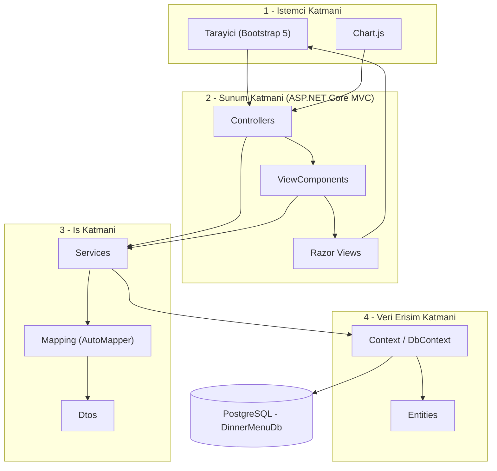
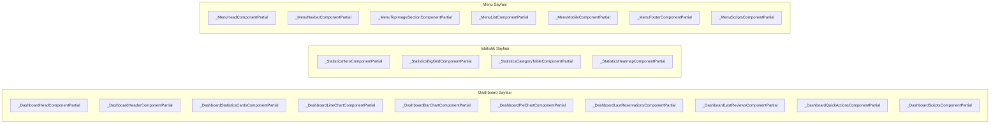
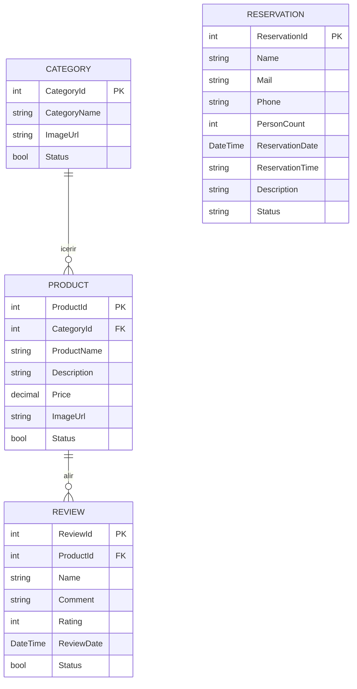
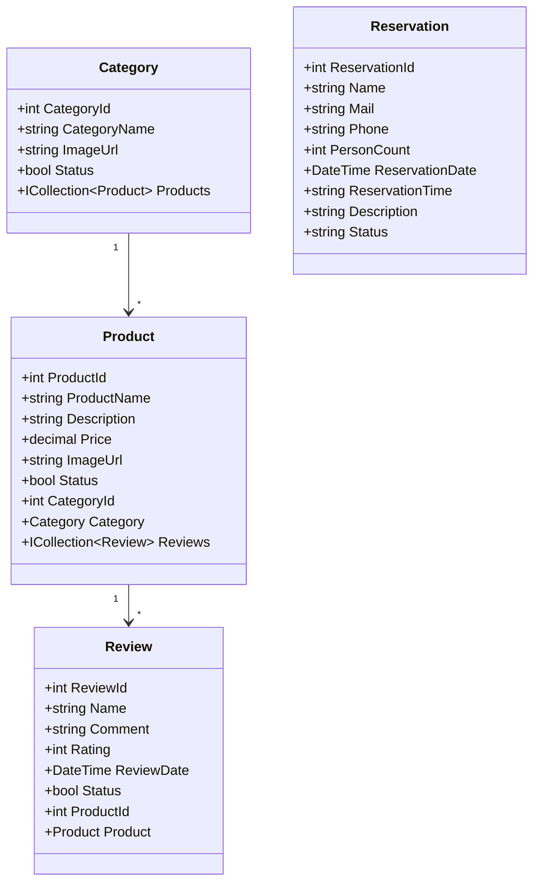
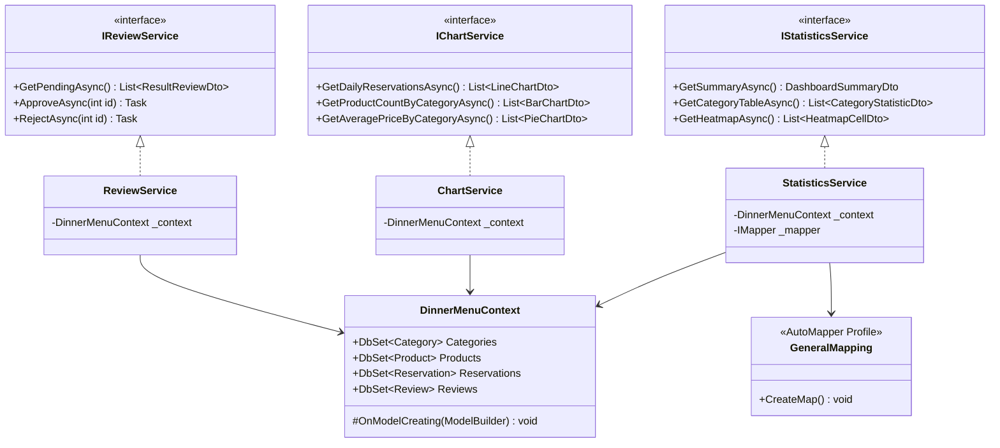
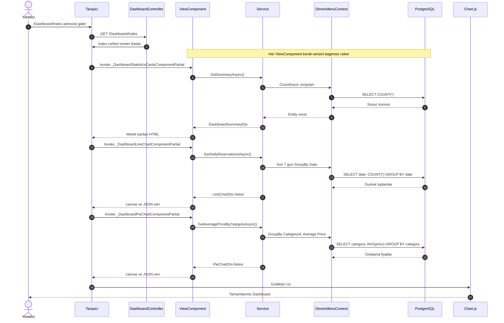
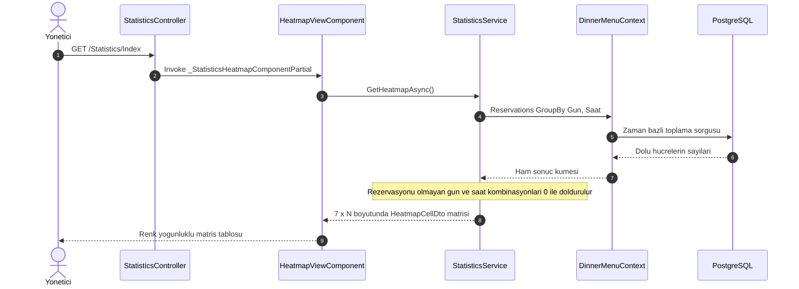
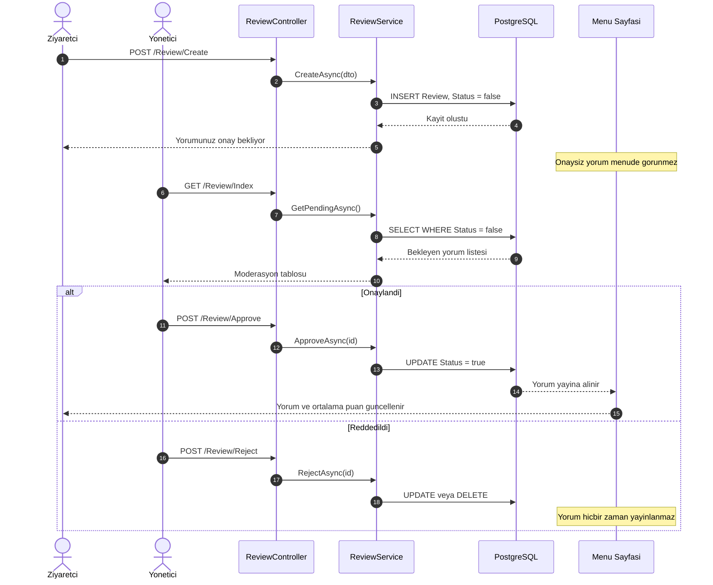
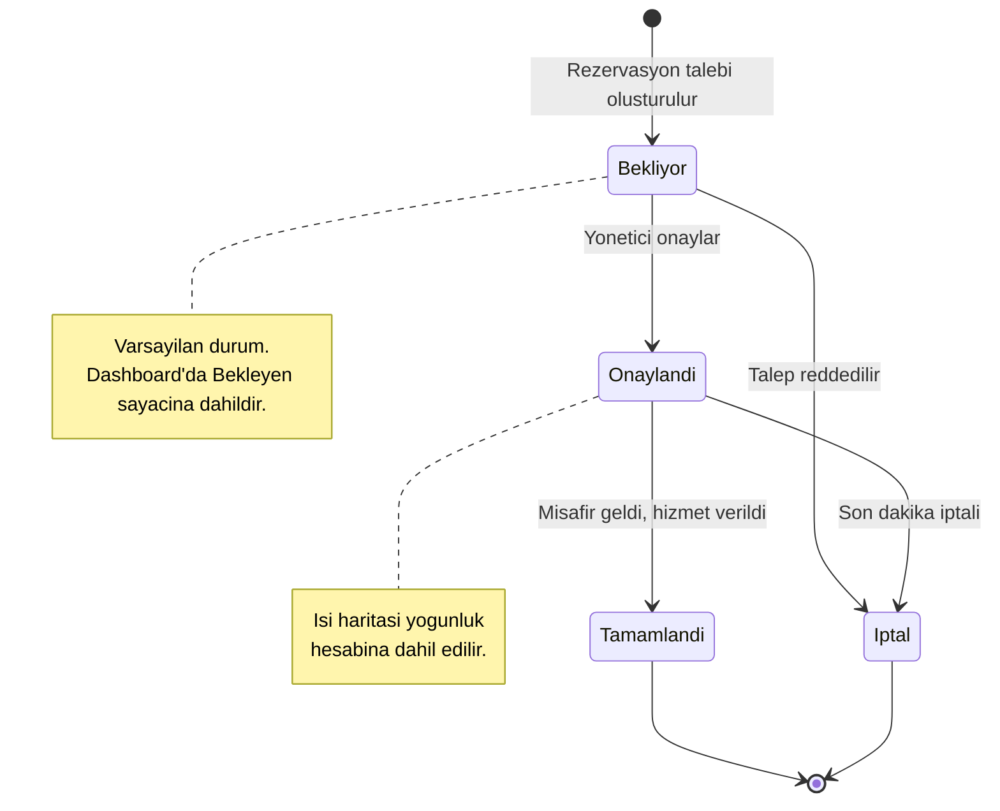
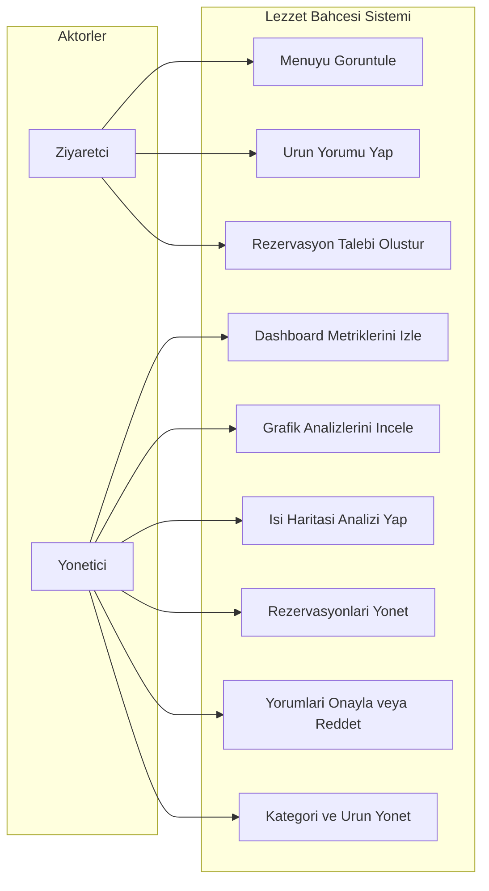

<div align="center">

# 🍽️ Lezzet Bahçesi

### Restoran Yönetim Paneli & Analitik Dashboard

*Rezervasyonlar, menü, kategoriler ve müşteri değerlendirmeleri — tek panelden, canlı verilerle.*

<br>

[](https://dotnet.microsoft.com/)
[](https://learn.microsoft.com/dotnet/csharp/)
[](https://www.postgresql.org/)
[](https://learn.microsoft.com/ef/core/)
[](https://getbootstrap.com/)
[](https://www.chartjs.org/)
[](LICENSE)

<br>

**🇹🇷 Türkçe** &nbsp;•&nbsp; [🇬🇧 English](README.en.md)

</div>

---

## 📑 İçindekiler

- [Proje Hakkında](#-proje-hakkında)
- [Öne Çıkan Özellikler](#-öne-çıkan-özellikler)
- [Ekran Görüntüleri](#-ekran-görüntüleri)
- [Teknoloji Yığını](#️-teknoloji-yığını)
- [Sistem Mimarisi](#️-sistem-mimarisi)
- [ViewComponent Kompozisyonu](#-viewcomponent-kompozisyonu)
- [Klasör Yapısı](#-klasör-yapısı)
- [Veritabanı Tasarımı & ER Diyagramı](#️-veritabanı-tasarımı--er-diyagramı)
- [UML Diyagramları](#-uml-diyagramları)
- [İstek Yaşam Döngüsü](#-i̇stek-yaşam-döngüsü)
- [Kurulum ve Çalıştırma](#-kurulum-ve-çalıştırma)
- [Yapılandırma](#️-yapılandırma)
- [Rota Haritası](#️-rota-haritası)
- [Sık Karşılaşılan Sorunlar](#-sık-karşılaşılan-sorunlar)
- [Yol Haritası](#️-yol-haritası)
- [Katkıda Bulunma](#-katkıda-bulunma)
- [Lisans](#-lisans)
- [Geliştirici](#️-geliştirici)

---

## 🎯 Proje Hakkında

Bir restoranın günlük işleyişinde veriler dağınıktır: rezervasyon defteri ayrı, menü ayrı, müşteri yorumları bambaşka bir yerdedir. **Lezzet Bahçesi**, bu parçalı akışı tek bir yönetim panelinde toplayarak *"Bugün kaç rezervasyon var? Hangi gün ve saatler yoğun? Hangi ürün beğenilmiyor?"* sorularına saniyeler içinde cevap verir.

Uygulama **ASP.NET Core MVC** üzerine kurulu, veri katmanında **PostgreSQL + Entity Framework Core (Code First)** kullanan bir web projesidir. En ayırt edici tarafı, sayfaların monolitik `.cshtml` dosyaları yerine **ViewComponent kompozisyonu** ile inşa edilmiş olmasıdır: her başlık, her grafik, her tablo kendi verisini kendi çeken bağımsız bir bileşendir.

### Neden bu proje?

| Problem | Çözüm |
|---|---|
| Rezervasyon yoğunluğu tahminle yönetiliyor | Gün × saat kırılımlı **ısı haritası** ile gerçek yoğunluk görselleştirmesi |
| Yorumlar denetimsiz yayınlanıyor | `Status` alanı üzerinden **admin onay mekanizması** |
| Menü performansı ölçülemiyor | Kategori bazlı **ürün dağılımı** ve **ortalama fiyat** analizleri |
| View dosyaları şişiyor, bakımı zorlaşıyor | Sayfa başına 5–10 **bağımsız ViewComponent** |

### Temel Tasarım Kararları

- **Sayfa = bileşen kompozisyonu.** `Dashboard/Index.cshtml` yalnızca ViewComponent çağrılarından oluşur; başlık, istatistik kartları, üç grafik, son rezervasyonlar, son yorumlar ve script bloğu ayrı ayrı bileşenlerdir. Biri hata verse sayfanın geri kalanı ayakta kalır.
- **Entity'ler asla View'a gönderilmez.** Tüm sunum verisi `Dtos/` altındaki özelleşmiş DTO'lar üzerinden taşınır; dönüşüm `Mapping/` klasöründeki profil ile merkezîdir.
- **İnce controller.** Controller yalnızca isteği karşılar; sorgu ve hesaplama `Services/` katmanındadır.
- **Null-safe analitik.** Isı haritası ve grafik sorgularında veri bulunmayan gün/saat kombinasyonları `0` olarak normalize edilir, matriste boşluk oluşmaz.

---

## 🚀 Öne Çıkan Özellikler

### 📊 1. Dashboard — Yönetim Paneli Ana Ekranı

`DashboardController` + `DashboardViewComponents` ile kurulmuştur.

| Bileşen | Görevi |
|---|---|
| `_DashboardStatisticsCardsComponentPartial` | Toplam rezervasyon, bekleyen/onaylanan/iptal kırılımı, toplam ürün, kategori ve yorum sayısı |
| `_DashboardLineChartComponentPartial` | Günlük rezervasyon trendi (Line) |
| `_DashboardBarChartComponentPartial` | Kategoriye göre ürün dağılımı (Bar) |
| `_DashboardPieChartComponentPartial` | Kategori ortalama fiyatları (Pie / Doughnut) |
| `_DashboardLastReservationsComponentPartial` | Son rezervasyon kayıtları tablosu |
| `_DashboardLastReviewsComponentPartial` | Son gelen yorumlar akışı |
| `_DashboardQuickActionsComponentPartial` | Sık kullanılan işlemlere hızlı erişim kısayolları |
| `_DashboardHeaderComponentPartial` | Panel üst başlığı ve özet bilgi |
| `_DashboardScriptsComponentPartial` | Chart.js konfigürasyonlarının tek noktadan yüklenmesi |

### 🔥 2. İstatistik & Isı Haritası Sayfası

`StatisticsController` + `StatisticsViewComponents` ile kurulmuştur.

- **`_StatisticsHeatmapComponentPartial`** — Haftanın günleri (satır) × saat dilimleri (sütun) matrisinde rezervasyon yoğunluğu. Hücre rengi rezervasyon sayısıyla orantılı koyulaşır; personel vardiyası ve stok planlaması için doğrudan kullanılabilir bir çıktı üretir.
- **`_StatisticsBigGridComponentPartial`** — Genel metriklerin geniş ızgara görünümü.
- **`_StatisticsCategoryTableComponentPartial`** — Kategori bazlı ürün sayısı ve ortalama fiyat tablosu.
- **`_StatisticsHeroComponentPartial`** — Sayfa üst bölümü ve öne çıkan metrik özeti.

### 💬 3. Müşteri Değerlendirmeleri (Review) Modülü

- **Ürün bazlı yorum sistemi:** Her ürün için ayrı puanlama (1–5 ⭐) ve serbest metin değerlendirmesi.
- **Onay mekanizması:** Yorumlar `Status = false` ile kaydedilir; yalnızca onaylananlar menüde görünür.
- **Moderasyon paneli:** `ReviewController` üzerinden onayla / reddet / sil aksiyonları.
- **Ortalama puan:** Ürünün yıldız ortalaması yalnızca onaylı yorumlar üzerinden hesaplanır.

### 📅 4. Rezervasyon Yönetimi

- Durum makinesiyle yönetilen akış: `Bekliyor → Onaylandı → Tamamlandı` / `İptal`.
- Ad, telefon, e-posta, kişi sayısı, tarih, saat ve açıklama alanları.
- Tarihe ve duruma göre filtreleme; ısı haritasının veri kaynağı bu tablodur.

### 🍕 5. Menü & Kategori Yönetimi

- `CategoryController` ve `ProductController` üzerinden tam CRUD.
- Kategori/ürün `Status` alanı ile aktif–pasif yönetimi; pasif kayıtlar analitiklerden otomatik düşer.
- **`MenuController` + `MenuViewComponents`** ile ziyaretçiye açık menü sayfası: navbar, üst görsel bölümü, ürün listesi, mobil görünüm ve footer ayrı bileşenlerdir.

---

## 📸 Ekran Görüntüleri


---

## 🛠️ Teknoloji Yığını

| Alan | Teknoloji | Kullanım Amacı |
|---|---|---|
| **Dil & Runtime** | C# 12, .NET 6.0 | Uygulama çekirdeği |
| **Web Framework** | ASP.NET Core MVC | Controller / View / Routing altyapısı |
| **ORM** | Entity Framework Core 8 | Code First, LINQ sorguları, Migration yönetimi |
| **Veritabanı** | PostgreSQL | İlişkisel veri deposu (`DinnerMenuDb`) |
| **DB Sağlayıcı** | Npgsql.EntityFrameworkCore.PostgreSQL | EF Core ↔ PostgreSQL köprüsü |
| **Nesne Dönüşümü** | AutoMapper | Entity ↔ DTO dönüşümü (`Mapping/`) |
| **Frontend** | HTML5, CSS3, JavaScript (ES6+) | Arayüz ve etkileşim |
| **UI Kütüphanesi** | Bootstrap 5 | Responsive grid ve bileşenler |
| **Görselleştirme** | Chart.js | Line / Bar / Pie grafikleri |
| **Şablon Motoru** | Razor (.cshtml) | Sunucu taraflı render |
| **Mimari Yaklaşım** | ViewComponent, DTO, Service Layer, Dependency Injection | Modülerlik ve bakım kolaylığı |

---

## 🏗️ Sistem Mimarisi

Proje, sorumlulukların net biçimde ayrıldığı katmanlı bir yapıdadır. Controller iş mantığı içermez; hesaplama servis katmanında, veri erişimi `Context` üzerinden yapılır.



### Uygulanan Yaklaşımlar

| Yaklaşım | Nerede? | Kazanım |
|---|---|---|
| **ViewComponent Kompozisyonu** | `ViewComponents/`, `Views/Shared/Components/` | Her sayfa parçası bağımsız, yeniden kullanılabilir ve kendi verisini çeken bir birim |
| **DTO Pattern** | `Dtos/` (özellik bazlı alt klasörler) | Entity'ler View'a sızmaz; yalnızca gerekli alanlar taşınır |
| **AutoMapper Profili** | `Mapping/` | Dönüşüm mantığı tek noktada, controller'lar temiz |
| **Service Layer** | `Services/` | İş kuralları ve analitik hesaplamalar controller'dan ayrıştırılmış |
| **Dependency Injection** | `Program.cs` | Servisler ve `DbContext` constructor üzerinden enjekte edilir |
| **Code First + Migrations** | `Migrations/` | Şema versiyonlanır, ortamlar arası tutarlılık sağlanır |
| **Özellik Bazlı Klasörleme** | `Dtos/`, `ViewComponents/` | `CategoryDtos`, `ChartDtos`, `DashboardViewComponents`... — dosya bulmak kolay |

---

## 🧩 ViewComponent Kompozisyonu

Projenin en karakteristik yanı budur: bir sayfa tek parça `.cshtml` değil, birden fazla bağımsız bileşenin bir araya gelmesidir.



Ortak grafik altyapısı `ChartViewComponents/_ChartComponentPartial` içinde toplanmıştır; Chart.js yapılandırması tekrar edilmez.

---

## 📁 Klasör Yapısı

```
DinnerMenu/
│
├── 📂 Context/                             # EF Core DbContext
│   └── DinnerMenuContext.cs
│
├── 📂 Controllers/
│   ├── AdminLayoutController.cs            # Yönetim paneli layout bileşenleri
│   ├── CategoryController.cs               # Kategori CRUD
│   ├── DashboardController.cs              # Ana panel
│   ├── HomeController.cs                   # Genel giriş sayfası
│   ├── MenuController.cs                   # Ziyaretçiye açık menü
│   ├── ProductController.cs                # Ürün CRUD
│   ├── ReservationController.cs            # Rezervasyon yönetimi
│   ├── ReviewController.cs                 # Yorum moderasyonu
│   └── StatisticsController.cs             # İstatistik & ısı haritası
│
├── 📂 Dtos/                                # Özellik bazlı veri taşıma nesneleri
│   ├── CategoryDtos/
│   ├── ChartDtos/                          # Grafik ve ısı haritası verileri
│   ├── ProductDtos/
│   ├── ReservationDtos/
│   └── ReviewDtos/
│
├── 📂 Entities/                            # Code First varlık sınıfları
│   ├── Category.cs
│   ├── Product.cs
│   ├── Reservation.cs
│   └── Review.cs
│
├── 📂 Mapping/                             # AutoMapper profilleri
├── 📂 Migrations/                          # EF Core migration geçmişi
├── 📂 Models/                              # ViewModel / ErrorViewModel
├── 📂 Properties/
│   └── launchSettings.json
│
├── 📂 Services/                            # İş kuralları & analitik sorgular
│
├── 📂 ViewComponents/
│   ├── ChartViewComponents/                # Ortak grafik bileşeni
│   ├── DashboardViewComponents/            # Panel bileşenleri
│   ├── MenuViewComponents/                 # Menü sayfası bileşenleri
│   └── StatisticsViewComponents/           # İstatistik & heatmap bileşenleri
│
├── 📂 Views/
│   ├── AdminLayout/
│   ├── Category/
│   ├── Dashboard/
│   ├── Home/
│   ├── Menu/
│   ├── Product/
│   ├── Reservation/
│   ├── Review/
│   ├── Statistics/
│   ├── Shared/
│   │   └── Components/                     # Her ViewComponent'in Default.cshtml'i
│   │       ├── _ChartComponentPartial/
│   │       ├── _DashboardStatisticsCardsComponentPartial/
│   │       ├── _DashboardLineChartComponentPartial/
│   │       ├── _StatisticsHeatmapComponentPartial/
│   │       └── ...
│   ├── _ViewImports.cshtml
│   └── _ViewStart.cshtml
│
├── 📂 wwwroot/
│   ├── css/
│   ├── js/
│   ├── lib/
│   └── images/screenshots/
│
├── appsettings.json
├── Program.cs
└── README.md
```

---

## 🗄️ Veritabanı Tasarımı & ER Diyagramı

Veri modeli bilinçli olarak sade tutulmuştur: dört varlık, iki ilişki. Müşteri bilgisi ayrı bir tabloda tutulmaz — rezervasyon ve yorum kayıtları iletişim/isim alanlarını kendi içlerinde taşır.




### Tablo Açıklamaları

| Tablo | Amaç | Kritik Alanlar |
|---|---|---|
| `Categories` | Menü kategorileri | `Status` — pasif kategoriler analitiklere dahil edilmez |
| `Products` | Menü ürünleri | `Price` (decimal), `CategoryId` (FK), `Status` |
| `Reviews` | Ürün değerlendirmeleri | `Rating` (1–5), `Status` — onay mekanizmasının anahtarı |
| `Reservations` | Rezervasyon kayıtları | `ReservationDate` + `ReservationTime` → ısı haritasının veri kaynağı |

### İlişkiler

```
Category  1 ────< N  Product     (Bir kategoride çok ürün)
Product   1 ────< N  Review      (Bir ürüne çok yorum)
Reservation                      (Bağımsız tablo, yabancı anahtar taşımaz)
```

---

## 📐 UML Diyagramları

### 1️⃣ Sınıf Diyagramı — Entities



### 2️⃣ Servis & Bileşen Katmanı




### 3️⃣ Sequence Diyagramı — Dashboard Yüklenmesi



### 4️⃣ Sequence Diyagramı — Isı Haritası Üretimi



### 5️⃣ Sequence Diyagramı — Yorum Moderasyonu



### 6️⃣ Durum Diyagramı — Rezervasyon Yaşam Döngüsü



### 7️⃣ Use Case Diyagramı



---

## 🔄 İstek Yaşam Döngüsü

| # | Aşama | Sorumlu | Ne olur? |
|---|---|---|---|
| 1 | HTTP İsteği | Kestrel / Middleware | İstek karşılanır, routing çalışır |
| 2 | Controller Action | `DashboardController` | İsteği karşılar, View döndürür |
| 3 | ViewComponent | `DashboardViewComponents` | Sayfa parçası kendi verisini talep eder |
| 4 | Service | `Services/` | İş kuralı ve analitik hesaplama yapılır |
| 5 | DbContext | `DinnerMenuContext` | LINQ ifadesi SQL'e çevrilir |
| 6 | PostgreSQL | Veritabanı | Sorgu çalışır, satırlar döner |
| 7 | Entity → DTO | `Mapping/` (AutoMapper) | Sadece gerekli alanlar taşınır |
| 8 | Razor View | `Views/Shared/Components/` | Bileşenin HTML çıktısı üretilir |
| 9 | Chart.js | Tarayıcı | JSON veriden grafik çizilir |

---

## ⚡ Kurulum ve Çalıştırma

### Gereksinimler

| Gereksinim | Minimum Sürüm | İndirme |
|---|---|---|
| .NET SDK | 8.0 | [dotnet.microsoft.com](https://dotnet.microsoft.com/download) |
| PostgreSQL | 14+ (16 önerilir) | [postgresql.org](https://www.postgresql.org/download/) |
| pgAdmin 4 | Güncel | [pgadmin.org](https://www.pgadmin.org/download/) |
| IDE | Visual Studio 2022 / VS Code | — |
| EF Core CLI | 8.0 | `dotnet tool install --global dotnet-ef` |

### Adım Adım Kurulum

**1. Depoyu klonlayın**

```bash
git clone https://github.com/yelda-batti0/DinaRestaurant-PostgreSQL.git
cd DinaRestaurant-PostgreSQL
```

**2. Bağımlılıkları yükleyin**

```bash
dotnet restore
```

**3. PostgreSQL veritabanını oluşturun**

```sql
CREATE DATABASE "DinnerMenuDb"
    WITH ENCODING = 'UTF8'
    TEMPLATE = template0;
```

**4. Bağlantı dizesini yapılandırın**

`appsettings.json`:

```json
{
  "ConnectionStrings": {
    "DefaultConnection": "Host=localhost;Port=5432;Database=DinnerMenuDb;Username=postgres;Password=SIFRENIZ;Client Encoding=UTF8;"
  },
  "AllowedHosts": "*"
}
```

> 🔐 Şifrenizi repoya göndermeyin. Geliştirme ortamında User Secrets kullanın:
> ```bash
> dotnet user-secrets init
> dotnet user-secrets set "ConnectionStrings:DefaultConnection" "Host=localhost;..."
> ```
>
> Bağlantı bilgisi `Context/DinnerMenuContext.cs` içinde `OnConfiguring` ile tanımlıysa, düzenlemeyi orada yapmanız gerekir.

**5. Migration'ları uygulayın**

```bash
dotnet ef migrations add InitialCreate
dotnet ef database update
```

Visual Studio **Package Manager Console** üzerinden:

```powershell
Add-Migration InitialCreate
Update-Database
```

**6. Uygulamayı çalıştırın**

```bash
dotnet run
# veya sıcak yeniden yükleme ile
dotnet watch run
```

**7. Tarayıcıda açın**

```
https://localhost:7044     → Ana sayfa
https://localhost:7044/Dashboard    → Yönetim paneli
https://localhost:7044/Statistics   → İstatistik & ısı haritası
https://localhost:7044/Menu         → Menü sayfası
```

> Portlar `Properties/launchSettings.json` dosyasında tanımlıdır.

### 🐳 Docker ile PostgreSQL (Opsiyonel)

```yaml
# docker-compose.yml
services:
  postgres:
    image: postgres:16-alpine
    container_name: lezzet-postgres
    environment:
      POSTGRES_DB: DinnerMenuDb
      POSTGRES_USER: postgres
      POSTGRES_PASSWORD: postgres
    ports:
      - "5432:5432"
    volumes:
      - lezzet-data:/var/lib/postgresql/data

volumes:
  lezzet-data:
```

```bash
docker compose up -d
```

---

## ⚙️ Yapılandırma

| Ayar | Dosya | Açıklama |
|---|---|---|
| `ConnectionStrings:DefaultConnection` | `appsettings.json` | PostgreSQL bağlantı bilgileri |
| `applicationUrl` | `Properties/launchSettings.json` | Uygulamanın çalışacağı port |
| Servis kayıtları | `Program.cs` | DI konteynerine servis ekleme |
| Fluent API kısıtları | `Context/DinnerMenuContext.cs` | İlişkiler, indeksler, `decimal` precision |
| Dönüşüm profilleri | `Mapping/` | Entity ↔ DTO eşleştirmeleri |

**`Program.cs` — tipik servis kaydı:**

```csharp
builder.Services.AddDbContext<DinnerMenuContext>(options =>
    options.UseNpgsql(builder.Configuration.GetConnectionString("DefaultConnection")));

builder.Services.AddAutoMapper(typeof(Program));

builder.Services.AddScoped<IStatisticsService, StatisticsService>();
builder.Services.AddScoped<IChartService, ChartService>();
builder.Services.AddScoped<IReviewService, ReviewService>();

builder.Services.AddControllersWithViews();
```

---

## 🗺️ Rota Haritası

| HTTP | Rota | Controller / Action | Açıklama |
|---|---|---|---|
| `GET` | `/` | `HomeController.Index` | Genel giriş sayfası |
| `GET` | `/Menu` | `MenuController.Index` | Ziyaretçiye açık menü |
| `GET` | `/Dashboard` | `DashboardController.Index` | Yönetim paneli ana ekranı |
| `GET` | `/Statistics` | `StatisticsController.Index` | İstatistikler ve ısı haritası |
| `GET` | `/Category` | `CategoryController.Index` | Kategori listesi |
| `GET` `POST` | `/Category/Create` | `CategoryController.Create` | Yeni kategori |
| `GET` `POST` | `/Category/Update/{id}` | `CategoryController.Update` | Kategori güncelleme |
| `GET` | `/Category/Delete/{id}` | `CategoryController.Delete` | Kategori silme |
| `GET` | `/Product` | `ProductController.Index` | Ürün listesi |
| `GET` `POST` | `/Product/Create` | `ProductController.Create` | Yeni ürün |
| `GET` | `/Reservation` | `ReservationController.Index` | Rezervasyon listesi |
| `POST` | `/Reservation/Approve/{id}` | `ReservationController.Approve` | Rezervasyonu onaylar |
| `POST` | `/Reservation/Cancel/{id}` | `ReservationController.Cancel` | Rezervasyonu iptal eder |
| `GET` | `/Review` | `ReviewController.Index` | Yorum moderasyon listesi |
| `POST` | `/Review/Approve/{id}` | `ReviewController.Approve` | Yorumu yayına alır |
| `POST` | `/Review/Reject/{id}` | `ReviewController.Reject` | Yorumu reddeder |

> Action adları projedeki gerçek imzalarla eşleştirilmelidir.

---

## 🐛 Sık Karşılaşılan Sorunlar

<details>
<summary><b>❗ "Cannot write DateTime with Kind=Local to PostgreSQL type 'timestamp with time zone'"</b></summary>

Npgsql 6.0+ sürümlerinde `DateTime` davranışı değişti. İki çözümden birini uygulayın:

```csharp
// Program.cs — en üste ekleyin
AppContext.SetSwitch("Npgsql.EnableLegacyTimestampBehavior", true);
```

veya entity'lerde UTC kullanın:

```csharp
public DateTime ReviewDate { get; set; } = DateTime.UtcNow;
```

</details>

<details>
<summary><b>❗ Türkçe karakterler bozuk görünüyor</b></summary>

Bağlantı dizesinde `Client Encoding=UTF8;` bulunduğundan ve veritabanının UTF8 ile oluşturulduğundan emin olun. Ayrıca layout dosyasında:

```html
<meta charset="utf-8" />
```

</details>

<details>
<summary><b>❗ ViewComponent bulunamıyor / render edilmiyor</b></summary>

Bileşenin görünüm dosyası şu yolda ve tam olarak `Default.cshtml` adıyla bulunmalıdır:

```
Views/Shared/Components/{BilesenAdi}/Default.cshtml
```

Sınıf adı `XComponentPartialViewComponent` ise çağrı `@await Component.InvokeAsync("XComponentPartial")` biçimindedir; klasör adı da `_` öneki dahil birebir eşleşmelidir.

</details>

<details>
<summary><b>❗ Grafikler boş görünüyor</b></summary>

Tarayıcı konsolunu açın (F12). Sık nedenler:
- Chart.js CDN yüklenmemiş → `_DashboardScriptsComponentPartial` içindeki script sırasını kontrol edin.
- Veri `@Html.Raw(Json.Serialize(Model))` ile serialize edilmemiş.
- Boş veri seti → null-safe projeksiyon uygulanmamış.

</details>

<details>
<summary><b>❗ Isı haritasında bazı hücreler boş</b></summary>

Rezervasyon bulunmayan gün/saat kombinasyonları için varsayılan `0` üretilmelidir:

```csharp
var matrix = Enumerable.Range(0, 7)
    .SelectMany(day => hours.Select(hour => new HeatmapCellDto
    {
        Day   = day,
        Hour  = hour,
        Count = data.FirstOrDefault(x => x.Day == day && x.Hour == hour)?.Count ?? 0
    })).ToList();
```

</details>

<details>
<summary><b>❗ AutoMapper "Unmapped members were found" hatası</b></summary>

`Mapping/` klasöründeki profil dosyasında ilgili eşleştirmenin tanımlı olduğundan emin olun:

```csharp
CreateMap<Product, ResultProductDto>().ReverseMap();
```

</details>

---

## 🗓️ Yol Haritası

- [x] Dashboard metrik kartları ve hızlı işlem kısayolları
- [x] Chart.js entegrasyonu (Line / Bar / Pie)
- [x] Rezervasyon ısı haritası
- [x] Yorum onay ve moderasyon sistemi
- [x] Kategori & ürün yönetimi
- [x] ViewComponent tabanlı sayfa kompozisyonu
- [ ] ASP.NET Core Identity ile rol bazlı kimlik doğrulama
- [ ] `Customer` ve `Order` varlıklarının eklenmesi (sipariş takibi)
- [ ] SignalR ile gerçek zamanlı rezervasyon bildirimleri
- [ ] Excel / PDF rapor dışa aktarımı
- [ ] REST API katmanı + Swagger dokümantasyonu
- [ ] Birim testleri (xUnit + Moq)
- [ ] Çok dilli arayüz (Localization)
- [ ] Redis ile dashboard sorgu önbellekleme

---

## 🤝 Katkıda Bulunma

1. Depoyu **fork** edin
2. Yeni bir dal oluşturun: `git checkout -b feature/harika-ozellik`
3. Değişikliklerinizi commit edin: `git commit -m "feat: harika özellik eklendi"`
4. Dalınızı push edin: `git push origin feature/harika-ozellik`
5. Bir **Pull Request** açın

**Commit biçimi:** [Conventional Commits](https://www.conventionalcommits.org/) — `feat:` · `fix:` · `docs:` · `refactor:` · `test:` · `chore:`

---

## 📄 Lisans

Bu proje **MIT Lisansı** ile lisanslanmıştır. Ayrıntılar için [LICENSE](LICENSE) dosyasına bakın.

---

## ✒️ Geliştirici

<div align="center">

### Yelda Battı
**Bilişim Sistemleri Mühendisliği Öğrencisi**

[](https://linkedin.com/in/yelda-batti)
[](https://github.com/yelda-batti0)

<br>

⭐ Proje işinize yaradıysa yıldız bırakmayı unutmayın!

</div>
